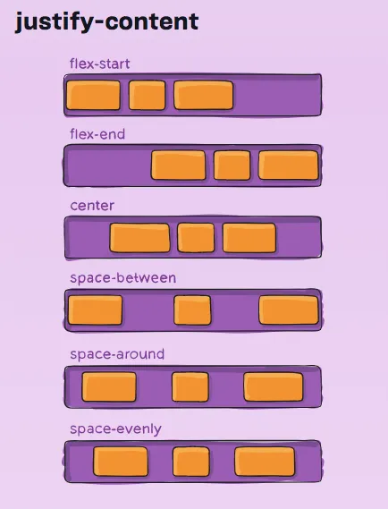
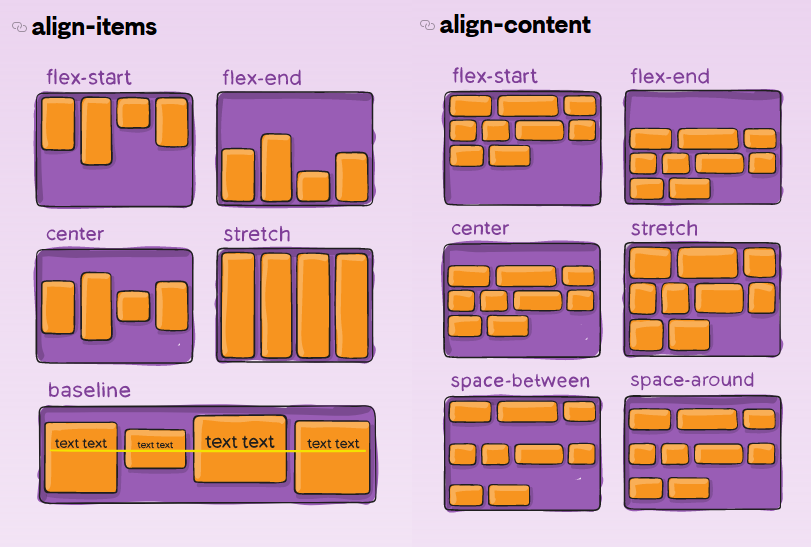

<span style='color:yellow'>**关于Flex布局的各参数，有一个比较好的[总结](https://juejin.cn/post/7004622232378966046)**</span>

在 CSS 的布局模型（尤其是 Flexbox 和 Grid）中，水平和垂直对齐方式主要通过 `justify-content`、`align-items` 和 `align-content` 等属性实现。这些属性的值提供了多种对齐选项，包括以下常见类型：
- [**1. 水平/垂直对齐方式的值**](#1-水平垂直对齐方式的值)
  - [**单一元素对齐（主轴或交叉轴方向）**](#单一元素对齐主轴或交叉轴方向)
  - [**空间分布对齐（主轴方向）**](#空间分布对齐主轴方向)
- [**2. 属性适用范围**](#2-属性适用范围)
  - [**(1) 主轴方向的对齐：`justify-content`**](#1-主轴方向的对齐justify-content)
  - [**(2) 交叉轴方向的对齐：`align-items`**](#2-交叉轴方向的对齐align-items)
  - [**(3) 多行内容的对齐：`align-content`**](#3-多行内容的对齐align-content)
- [**3. 快速对照表**](#3-快速对照表)
- [**4. 总结图例**](#4-总结图例)
---

### **1. 水平/垂直对齐方式的值**
这些值可以应用于 `justify-content`（主轴对齐）、`align-items` 和 `align-content`（交叉轴对齐）等属性。

#### **单一元素对齐（主轴或交叉轴方向）**
- **`flex-start`**：起始对齐，将元素放在容器的起始位置。
- **`flex-end`**：结束对齐，将元素放在容器的结束位置。
- **`center`**：居中对齐，将元素放在容器的中间。
- **`baseline`**（仅适用于**交叉轴**）：基于元素的文本基线对齐。
- **`stretch`**（默认值，**交叉轴**）：拉伸元素以填满交叉轴方向的容器。

#### **空间分布对齐（主轴方向）**
- **`space-between`**：元素之间平均分布，首尾没有间距。
- **`space-around`**：元素之间和首尾有均等的间距，首尾间距是中间间距的一半。
- **`space-evenly`**：元素之间和首尾都有均等的间距。

---

### **2. 属性适用范围**

#### **(1) 主轴方向的对齐：`justify-content`**
定义主轴方向上元素的对齐方式，通常是水平对齐（在 `flex-direction: row` 时）。
```css
.container {
  display: flex;
  justify-content: flex-start; /* 可选值：flex-end, center, space-between, space-around, space-evenly */
}
```

#### **(2) 交叉轴方向的对齐：`align-items`**
定义单行元素在交叉轴上的对齐方式，通常是垂直对齐（在 `flex-direction: row` 时）。
```css
.container {
  display: flex;
  align-items: center; /* 可选值：flex-start, flex-end, center, baseline, stretch */
}
```

#### **(3) 多行内容的对齐：`align-content`**
用于控制多行内容在交叉轴上的分布，仅当容器有多行内容时生效。
```css
.container {
  display: flex;
  flex-wrap: wrap;
  align-content: space-between; /* 可选值：flex-start, flex-end, center, space-around, space-evenly, stretch */
}
```

---

### **3. 快速对照表**

| 属性              | 方向       | 适用范围       | 常用值                                                 |
| ----------------- | ---------- | -------------- | ------------------------------------------------------ |
| `justify-content` | 主轴方向   | 子元素间的分布 | `flex-start`, `center`, `space-around`, `space-evenly` |
| `align-items`     | 交叉轴方向 | 单行内容对齐   | `stretch`, `center`, `baseline`, `flex-end`            |
| `align-content`   | 交叉轴方向 | 多行内容对齐   | `space-between`, `flex-start`, `stretch`               |

<span style='color:pink'>补充说一句，当单位区域内存在多行内容时，`align-items`，`align-content`都是可以使用的，但是区别在于：

- 使用`align-items`时，多行内容是作为一个整体，进行移动对齐
- 使用`align-content`时，每一行内容各自作为一个整体，分别进行移动对齐

---

### **4. 总结图例**

- 
- 