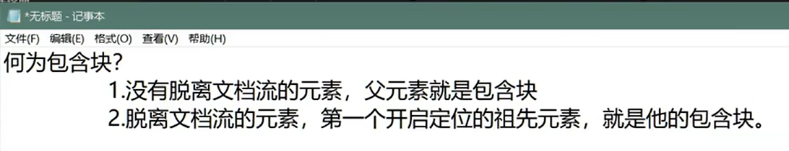

*尚硅谷给的定义*

---
CSS 中的“包含块”（containing block）是一个与定位和尺寸计算相关的重要概念。简单来说，包含块是决定元素的几何位置和大小的参考框。

在 CSS 中，元素的定位（例如 `position: absolute` 或 `position: relative`）和大小通常依赖于它们的包含块。具体来说，包含块是用于计算元素的 `top`、`right`、`bottom`、`left` 和 `width`、`height` 的坐标系统。

### 包含块的确定规则：
1. **静态定位（position: static）**: 对于大多数元素（默认的 `position: static`），它们并没有直接的包含块概念，因为它们的布局是由父元素的流动布局决定的。
   
2. **绝对定位（position: absolute）**: 当元素使用 `position: absolute` 时，它的包含块通常是最近的 **已定位祖先元素**（即 `position` 属性值不为 `static` 的祖先元素）。如果没有已定位的祖先元素，那么包含块就是 **视口（viewport）**。

3. **相对定位（position: relative）**: 对于 `position: relative` 的元素，它的包含块是 **最近已定位的祖先元素**，或者是 **它自己**，如果没有已定位的祖先元素。

4. **固定定位（position: fixed）**: 使用 `position: fixed` 的元素，其包含块是 **视口**，即相对于浏览器窗口的固定位置。

5. **粘性定位（position: sticky）**: 对于 `position: sticky` 元素，它的包含块是 **最近的滚动祖先元素**，也就是具有 `overflow: auto` 或 `overflow: scroll` 的元素。如果没有滚动容器，则包含块为 **视口**。

### 例子：

```html
<div style="position: relative; width: 300px; height: 300px; background-color: lightblue;">
  <div style="position: absolute; top: 50px; left: 50px; width: 100px; height: 100px; background-color: coral;">
    Absolute Positioned Box
  </div>
</div>
```

在这个例子中，内部的 `div` 使用了 `position: absolute`，它的包含块是外部的 `div`，因为外部 `div` 使用了 `position: relative`，所以它成为了内部元素的包含块。

### 小结：
包含块概念在 CSS 中非常重要，尤其是在使用定位（如 `absolute` 或 `relative`）时，它决定了元素的定位参考点。